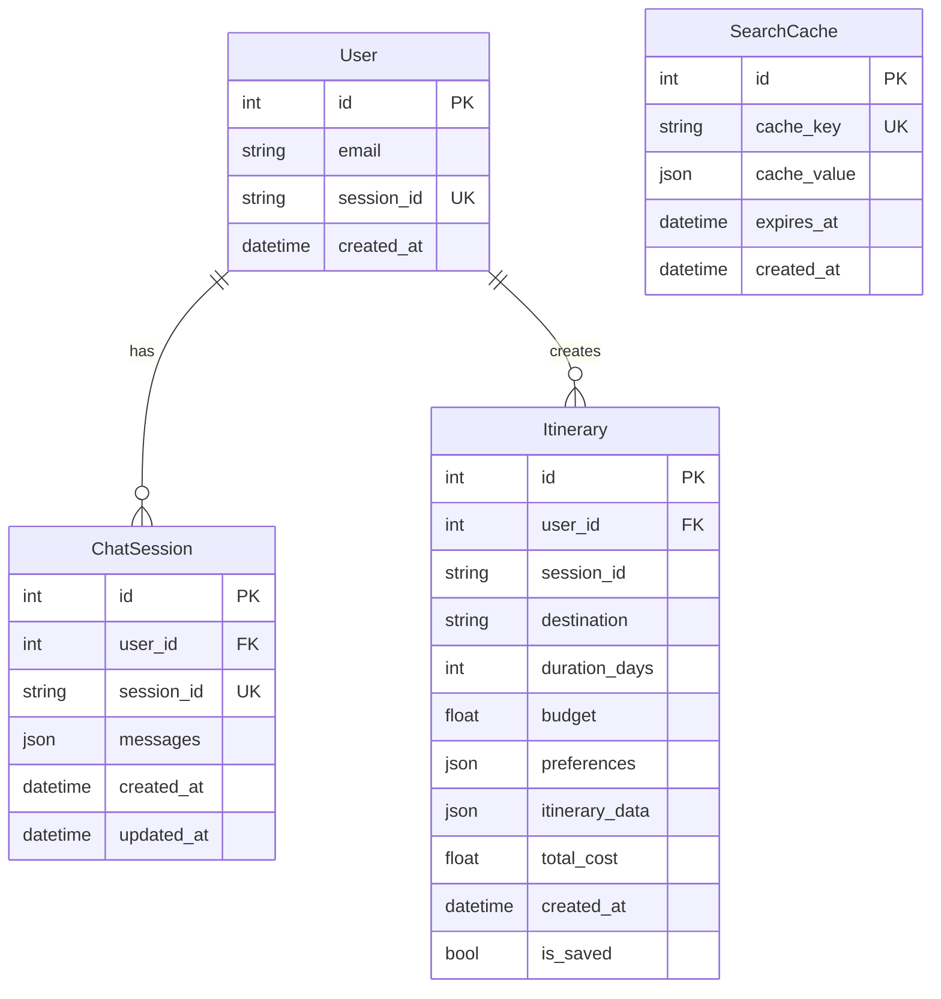

# 🌍 AI Travel Agent — Complete Project Walkthrough

> **Version:** 1.0.0 | **Last Updated:** February 2026

---

## 1. Project Overview

The AI Travel Agent is a **full-stack AI-powered travel planning application** that generates personalized trip itineraries with **real-time pricing data** for flights, hotels, and restaurants. Users can interact through natural language chat (AI-powered) or a structured manual planning form.

### Core Value Proposition

- Natural language trip planning via an AI agent
- Real-time flight, hotel, and restaurant pricing from live APIs
- Budget-aware itinerary generation
- Dual interaction modes: **AI Chat** and **Manual Planning Form**

---

## 2. Tech Stack

### Backend

| Technology | Version | Purpose |
|---|---|---|
| **Python** | 3.11 | Core language |
| **FastAPI** | 0.109.0 | REST API framework with async support |
| **Uvicorn** | 0.27.0 | ASGI server |
| **LangChain** | ≥0.3.0 | AI agent orchestration (ReAct pattern) |
| **LangChain OpenAI** | ≥0.3.0 | Ollama integration (OpenAI-compatible) |
| **LangChain Google GenAI** | ≥2.0.0 | Gemini model integration |
| **SQLAlchemy** | 2.0.25 | ORM for PostgreSQL |
| **Alembic** | 1.13.1 | Database migrations |
| **Pydantic** | 2.5.3 | Data validation & schemas |
| **Redis** | 5.0.1 | Caching & session management |
| **Requests / HTTPX / aiohttp** | Various | External API clients |

### Frontend

| Technology | Version | Purpose |
|---|---|---|
| **Next.js** | 14.1.0 | React meta-framework (App Router) |
| **React** | 18.2.0 | UI library |
| **TypeScript** | 5.3.3 | Type safety |
| **TailwindCSS** | 3.4.1 | Utility-first CSS |
| **Framer Motion** | 11.18.2 | Animations & transitions |
| **Lucide React** | 0.309.0 | Icon library |
| **Axios** | 1.6.5 | HTTP client |
| **react-markdown** | 9.0.1 | Markdown rendering for AI responses |
| **html2canvas + jsPDF** | — | PDF export of itineraries |

### Infrastructure

| Technology | Version | Purpose |
|---|---|---|
| **Docker & Docker Compose** | 3.8 (compose) | Containerized deployment |
| **PostgreSQL** | 15-alpine | Persistent data storage |
| **Redis** | 7-alpine | Caching, sessions, rate limiting |
| **Ollama** | Host-side | Local LLM inference (Qwen3, Gemma2) |

### External APIs

| API | Purpose |
|---|---|
| **SerpAPI** | Flight search (Google Flights) & web search |
| **RapidAPI** | Hotel search |
| **Foursquare** | Restaurant search & recommendations |
| **Google Gemini API** | Cloud LLM (Gemini 2.0 Flash) |

---

## 3. Architecture

```
┌──────────────────────────────────────────────────────────────┐
│                     Docker Compose Network                   │
│                                                              │
│  ┌─────────────┐   ┌──────────────┐   ┌──────────────────┐  │
│  │  Frontend    │   │   Backend    │   │    PostgreSQL     │  │
│  │  (Next.js)   │──▶│  (FastAPI)   │──▶│    Port 5432     │  │
│  │  Port 3000   │   │  Port 8000   │   └──────────────────┘  │
│  └─────────────┘   │              │   ┌──────────────────┐  │
│                     │              │──▶│      Redis        │  │
│                     │              │   │    Port 6379      │  │
│                     └──────┬───────┘   └──────────────────┘  │
│                            │                                 │
└────────────────────────────┼─────────────────────────────────┘
                             │
              ┌──────────────┼──────────────┐
              ▼              ▼              ▼
        ┌──────────┐  ┌──────────┐  ┌─────────────┐
        │  Ollama   │  │ SerpAPI  │  │  Foursquare │
        │ (Host)    │  │ RapidAPI │  │     API     │
        │ Qwen/Gemma│  │ Flights  │  │ Restaurants │
        └──────────┘  │  Hotels  │  └─────────────┘
                      └──────────┘
```

---

## 4. Project Structure

```
ai-travel-agent/
├── docker-compose.yml          # Orchestrates all 4 services
├── .env / .env.example         # Environment variables (API keys, passwords)
│
├── backend/
│   ├── Dockerfile              # Python 3.11-slim image
│   ├── requirements.txt        # Python dependencies
│   └── app/
│       ├── main.py             # FastAPI app, CORS, routers, lifespan
│       ├── config.py           # Pydantic settings (DB, Redis, LLM, APIs)
│       ├── agents/
│       │   ├── travel_agent.py # LangChain ReAct agent (Ollama + Gemini)
│       │   ├── prompts.py      # System prompts & ReAct template
│       │   └── callbacks.py    # Streaming callbacks
│       ├── api/routes/
│       │   ├── chat.py         # SSE streaming + sync chat endpoints
│       │   ├── manual_plan.py  # Form-based itinerary generation
│       │   ├── itinerary.py    # Save/retrieve itineraries
│       │   └── health.py       # Health check (DB + Redis)
│       ├── tools/
│       │   ├── __init__.py     # 6 LangChain tools + wrappers
│       │   ├── real_api.py     # SerpAPI, RapidAPI, Foursquare clients
│       │   ├── flight_search.py
│       │   ├── hotel_search.py
│       │   ├── restaurant_finder.py
│       │   ├── budget_calculator.py
│       │   ├── itinerary_builder.py
│       │   └── google_search.py
│       ├── models/
│       │   ├── database.py     # SQLAlchemy models (User, ChatSession, Itinerary, SearchCache)
│       │   └── schemas.py      # Pydantic request/response schemas
│       ├── services/
│       │   ├── db_service.py   # CRUD operations (users, sessions, itineraries)
│       │   └── redis_service.py# Singleton Redis client (cache, sessions, rate limiting)
│       └── utils/
│
└── frontend/
    ├── Dockerfile              # Node 20-alpine image
    ├── package.json            # Next.js 14 + React 18 + dependencies
    ├── tailwind.config.js
    ├── next.config.js
    ├── app/
    │   ├── layout.tsx          # Root layout with ThemeProvider
    │   ├── page.tsx            # Main page (hero, mode toggle, content)
    │   └── globals.css         # Global styles & custom design tokens
    ├── components/
    │   ├── chat/
    │   │   ├── ChatInterface.tsx     # AI chat with SSE streaming
    │   │   ├── MessageBubble.tsx     # Chat message display
    │   │   └── StreamingIndicator.tsx# Typing/loading animation
    │   ├── itinerary/
    │   │   ├── ItineraryDisplay.tsx  # Full itinerary renderer
    │   │   ├── DayPlan.tsx          # Day-by-day plan view
    │   │   └── BudgetBreakdown.tsx   # Budget visualization
    │   ├── planning/
    │   │   └── ManualPlanningForm.tsx# Form-based trip input
    │   └── ui/
    │       ├── ThemeProvider.tsx     # Dark/Light mode context
    │       ├── BackgroundSlider.tsx  # Animated travel backgrounds
    │       └── SkeletonLoader.tsx    # Loading placeholders
    └── lib/
        ├── api-client.ts      # API functions (streaming, sync, save, health)
        ├── types.ts           # TypeScript interfaces
        └── utils.ts           # Utility helpers
```

---

## 5. Backend Deep Dive

### 5.1 — AI Agent (`agents/travel_agent.py`)

The core intelligence uses **LangChain's ReAct (Reasoning + Acting) pattern**:

- **Model Router:** Automatically selects between local Ollama models (Qwen3:8b, Gemma2:9b) and Google Gemini API based on the model name
- **Memory:** `ConversationSummaryBufferMemory` — keeps recent messages verbatim and summarizes older ones (2000 token limit)
- **Session Persistence:** Conversation history is loaded from / saved to Redis
- **Tool Execution:** The agent reasons step-by-step, invoking tools as needed, then synthesizes a final answer
- **Max Iterations:** 25 (with parsing error handling)

**Available Models:**

| Model | Provider | Type |
|---|---|---|
| `qwen3:8b` | Ollama (local) | Default |
| `gemma2:9b` | Ollama (local) | Alternative |
| `gemini-2.0-flash` | Google API (cloud) | Fast cloud model |

### 5.2 — LangChain Tools (6 Tools)

| Tool | Description | Data Source | Fallback |
|---|---|---|---|
| `google_search` | Web search for travel info | SerpAPI | Error JSON |
| `flight_search` | Real flight data | SerpAPI (Google Flights) | Mock data |
| `hotel_search` | Hotel listings & prices | RapidAPI | Mock data |
| `restaurant_finder` | Restaurant recommendations | Foursquare API | Mock data |
| `budget_calculator` | Estimate trip costs | Internal calculation | — |
| `itinerary_builder` | Generate day-by-day plan | Internal logic | — |

**Key Design Decisions:**

- All tools accept a single JSON string input (LangChain ReAct compatibility)
- Results are cached in Redis (30–60 min TTL)
- Real API calls gracefully fall back to mock data if APIs are unavailable
- Wrapper functions parse JSON or treat input as a simple string

### 5.3 — API Endpoints

| Method | Endpoint | Description |
|---|---|---|
| `POST` | `/api/chat/` | **AI chat with SSE streaming** — rate limited (20 req/hr) |
| `POST` | `/api/chat/sync` | AI chat (non-streaming, returns complete response) |
| `GET` | `/api/chat/history/{session_id}` | Retrieve conversation history |
| `DELETE` | `/api/chat/history/{session_id}` | Clear conversation history |
| `POST` | `/api/manual-plan` | **Manual planning** — bypasses AI, calls tools directly |
| `POST` | `/api/itinerary/save` | Save itinerary to PostgreSQL |
| `GET` | `/api/itinerary/{id}` | Retrieve saved itinerary |
| `GET` | `/health/` | Health check (DB + Redis status) |

### 5.4 — Database Schema (PostgreSQL)



### 5.5 — Redis Usage

| Feature | Key Pattern | TTL |
|---|---|---|
| **Session Management** | `session:{session_id}` | 24 hours |
| **Rate Limiting** | `ratelimit:{user_id}` | 1 hour (20 req/hr) |
| **Flight Cache** | `flights:{origin}:{dest}:...` | 30 minutes |
| **Hotel Cache** | `hotels:{city}:...` | 30 minutes |
| **Restaurant Cache** | `restaurants:{city}:...` | 60 minutes |
| **Search Cache** | `google_search:{query}:...` | 60 minutes |

---

## 6. Frontend Deep Dive

### 6.1 — Two Interaction Modes

1. **AI Chat Mode** — Conversational interface with streaming responses via SSE
2. **Manual Planning Mode** — Structured form (origin, destination, dates, budget, preferences)

Both modes output data to the **ItineraryDisplay** component.

### 6.2 — Key Components

| Component | Purpose |
|---|---|
| `ChatInterface` | Full chat UI with SSE streaming, message history, model selection |
| `MessageBubble` | Individual message rendering (supports markdown) |
| `StreamingIndicator` | Animated typing indicator during AI processing |
| `ManualPlanningForm` | Form inputs for structured trip planning |
| `ItineraryDisplay` | Renders complete itinerary (flights, hotels, daily plans) |
| `DayPlan` | Single day view (morning/afternoon/evening activities) |
| `BudgetBreakdown` | Visual budget analysis |
| `ThemeProvider` | Dark/light mode toggle (React Context) |
| `BackgroundSlider` | Animated travel-themed background imagery |
| `SkeletonLoader` | Loading state placeholders |

### 6.3 — API Client (`lib/api-client.ts`)

- **`sendMessageStreaming()`** — SSE streaming via `fetch` + `ReadableStream` reader
- **`sendMessageSync()`** — Standard POST for non-streaming responses
- **`saveItinerary()`** — Persist itinerary to database
- **`getChatHistory()`** — Load previous conversations
- **`checkHealth()`** — Verify backend availability
- **`generateSessionId()`** — Creates unique session identifiers

### 6.4 — UI Features

- **Dark/Light theme toggle** with system preference detection
- **Model selector** dropdown (Qwen3, Gemma2, Gemini 2.0 Flash)
- **Sample prompts** (quick-start trip ideas)
- **Responsive layout** — single column on mobile, side-by-side on desktop
- **Glassmorphism effects** — frosted glass cards + backdrop-blur
- **Micro-animations** — Framer Motion staggered reveals, hover effects, pulse indicators
- **PDF export** — itineraries can be exported via html2canvas + jsPDF

---

## 7. Data Flow

### AI Chat Flow

```
User Message
    │
    ▼
Frontend (ChatInterface) ──SSE POST──▶ Backend /api/chat/
    │                                       │
    │                                       ▼
    │                              Rate Limit Check (Redis)
    │                                       │
    │                                       ▼
    │                              TravelPlanningAgent.plan_trip()
    │                                       │
    │                              ┌────────┴────────┐
    │                              │  ReAct Loop      │
    │                              │  Thought → Action │
    │                              │  → Observation    │
    │                              │  (repeat)         │
    │                              └────────┬────────┘
    │                                       │
    │                              Tool Calls (cached via Redis):
    │                              • flight_search → SerpAPI
    │                              • hotel_search → RapidAPI
    │                              • restaurant_finder → Foursquare
    │                              • budget_calculator
    │                              • itinerary_builder
    │                                       │
    │                                       ▼
    │                              Final Answer + Collected Data
    │                                       │
    │◀──── SSE Stream (status → tokens → result) ────┘
    │
    ▼
ItineraryDisplay (renders structured data)
```

### Manual Planning Flow

```
Form Submission
    │
    ▼
Frontend (ManualPlanningForm) ──POST──▶ Backend /api/manual-plan
    │                                       │
    │                              Direct Tool Calls (no AI):
    │                              1. flight_search()
    │                              2. hotel_search()
    │                              3. restaurant_finder()
    │                              4. budget_calculator()
    │                              5. itinerary_builder()
    │                                       │
    │◀──── JSON Response ───────────────────┘
    │
    ▼
ItineraryDisplay (renders structured data)
```

---

## 8. Environment Configuration

```bash
# Database
DB_PASSWORD=your_db_password

# Redis
REDIS_PASSWORD=your_redis_password

# LLM (Ollama runs on host, accessed via host.docker.internal)
OPENAI_API_BASE=http://host.docker.internal:11434/v1
OPENAI_API_KEY=ollama
MODEL_NAME=qwen3:8b

# Google Gemini (optional, for cloud model)
GOOGLE_API_KEY=your_google_api_key

# External APIs
SERPAPI_KEY=your_serpapi_key           # Flights + web search
RAPIDAPI_KEY=your_rapidapi_key       # Hotel search
FOURSQUARE_API_KEY=your_foursquare_key  # Restaurant search

# Application
SECRET_KEY=your-super-secret-key
ENVIRONMENT=development
LOG_LEVEL=INFO
```

---

## 9. Running the Application

```bash
# 1. Prerequisites: Docker Desktop + Ollama installed
# 2. Pull a local model
ollama pull qwen3:8b

# 3. Copy and configure environment
cp .env.example .env
# Edit .env with your API keys

# 4. Start all services
docker compose up --build

# Services available at:
# Frontend:  http://localhost:3000
# Backend:   http://localhost:8000
# API Docs:  http://localhost:8000/docs
# PostgreSQL: localhost:5432
# Redis:      localhost:6379
```

---

## 10. Key Design Decisions

| Decision | Rationale |
|---|---|
| **ReAct agent pattern** | Works reliably with smaller local models that don't support native function calling |
| **Ollama + cloud hybrid** | Local-first for privacy & cost; cloud Gemini as a quality fallback |
| **Redis for sessions** | Fast ephemeral storage with TTL; offloads session state from the DB |
| **PostgreSQL for persistence** | Durable storage for saved itineraries and user data |
| **Mock data fallbacks** | Graceful degradation when API keys are missing or quotas exhausted |
| **SSE streaming** | Better UX — user sees progressive response instead of waiting |
| **Docker Compose** | One-command setup for the entire 4-service stack |
| **DNS override (8.8.8.8)** | Fixes external API connectivity from Docker containers on certain networks |

---

## 11. Pydantic Schemas Summary

| Schema | Purpose |
|---|---|
| `ChatRequest` | Chat input: message, session_id, model |
| `ChatResponse` | Chat output: response text, session_id, itinerary |
| `ItinerarySchema` | Complete itinerary with flights, hotels, daily plans, budget |
| `FlightSchema` | Flight details (airline, price, times, booking link) |
| `HotelSchema` | Hotel details (name, price, rating, amenities, booking link) |
| `DayPlanSchema` | Single day with morning/afternoon/evening activities |
| `BudgetBreakdownSchema` | Cost breakdown by category (flights, food, activities, etc.) |
| `HealthCheckResponse` | DB + Redis connection status |

---

> **Note:** The application defaults to INR (Indian Rupee) for pricing, and the AI agent's system date is set to **2026-05-01** to ensure future date planning.
