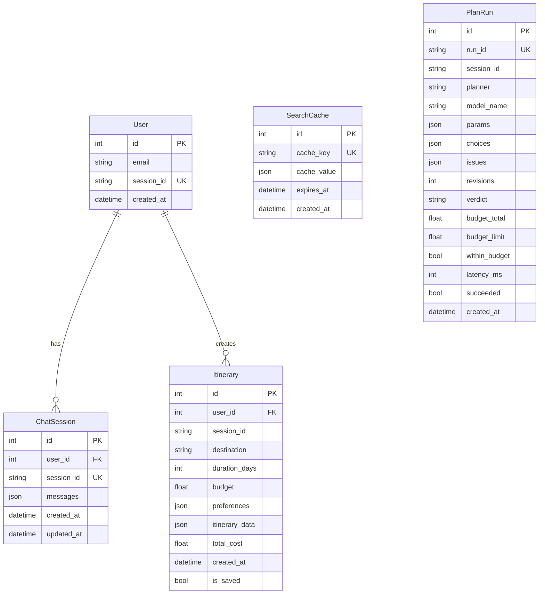

# 🌍 AI Travel Agent — Complete Project Walkthrough

> **Version:** 2.0.0 | **Last Updated:** July 2026

---

## 1. Project Overview

The AI Travel Agent is a **full-stack AI-powered travel planning application** that generates personalized trip itineraries with **real-time pricing data** for flights, hotels, and restaurants. Users can interact through natural language chat (AI-powered) or a structured manual planning form.

### Core Value Proposition

- Natural language trip planning
- Real-time flight, hotel and place data, with an honest fallback when a source is unavailable
- Budget-aware itinerary generation — and, on the multi-agent planner, a budget the plan is actually *held to*
- Dual interaction modes: **AI Chat** and **Manual Planning Form**

### Two planners

The same work can be run two ways, chosen per request or by the `PLANNER`
setting. Both expose the same interface, so the API routes and the eval
harness cannot tell them apart.

| Planner | What it does | When to use it |
|---|---|---|
| `pipeline` (default) | Extract parameters → fetch every source in parallel → cost the trip → write the answer. One pass, fully deterministic. | Fastest path; the baseline everything else is measured against. |
| `graph` | The same work as a LangGraph state machine: a supervisor sets budget-derived constraints, three specialist desks choose and explain their picks, and a critic can send the plan back for a bounded revision round. | When the plan should be held to the budget and the reasoning should be visible. |

§13 has the measured difference between them.

---

## 2. Tech Stack

### Backend

| Technology | Version | Purpose |
|---|---|---|
| **Python** | 3.11 | Core language |
| **FastAPI** | 0.109.0 | REST API framework with async support |
| **Uvicorn** | 0.27.0 | ASGI server |
| **LangGraph** | ≥0.2.60 | Multi-agent orchestration (the `graph` planner) |
| **LangChain OpenAI** | ≥0.3.0 | Ollama integration (OpenAI-compatible) |
| **LangChain Google GenAI** | ≥2.0.0 | Gemini model integration |
| **SQLAlchemy** | 2.0.25 | ORM for PostgreSQL |
| **Alembic** | 1.13.1 | Database migrations |
| **Pydantic** | 2.5.3 | Data validation & schemas |
| **Redis** | 5.0.1 | Caching & session management |
| **Requests / HTTPX / aiohttp** | Various | External API clients |

### Frontend

| Technology | Version | Purpose |
|---|---|---|
| **Next.js** | 14.1.0 | React meta-framework (App Router) |
| **React** | 18.2.0 | UI library |
| **TypeScript** | 5.3.3 | Type safety |
| **TailwindCSS** | 3.4.1 | Utility-first CSS |
| **Framer Motion** | 11.18.2 | Animations & transitions |
| **Lucide React** | 0.309.0 | Icon library |
| **Axios** | 1.6.5 | HTTP client |
| **react-markdown** | 9.0.1 | Markdown rendering for AI responses |
| **html2canvas + jsPDF** | — | PDF export of itineraries |

### Infrastructure

| Technology | Version | Purpose |
|---|---|---|
| **Docker & Docker Compose** | 3.8 (compose) | Containerized deployment |
| **PostgreSQL** | 15-alpine | Persistent data storage |
| **Redis** | 7-alpine | Caching, sessions, rate limiting |
| **Ollama** | Host-side | Local LLM inference (Qwen3, Gemma2) |

### External APIs

| API | Purpose |
|---|---|
| **SerpAPI** | Flight search (Google Flights) & web search |
| **RapidAPI** | Hotel search |
| **OpenStreetMap (Overpass + Nominatim)** | Restaurants and sights, with coordinates |
| **Google Gemini API** | Cloud LLM (`gemini-flash-latest` aliases) |

> Foursquare is no longer consulted: its v3 API was retired on 2026-05-15 and
> returned 410, so calling it only bought a timeout before the fallback.
> Places now come from OpenStreetMap, which also supplies the coordinates the
> multi-agent planner needs to group a day's stops by area.

---

## 3. Architecture

```
┌──────────────────────────────────────────────────────────────┐
│                     Docker Compose Network                   │
│                                                              │
│  ┌─────────────┐   ┌──────────────┐   ┌──────────────────┐  │
│  │  Frontend    │   │   Backend    │   │    PostgreSQL     │  │
│  │  (Next.js)   │──▶│  (FastAPI)   │──▶│    Port 5432     │  │
│  │  Port 3000   │   │  Port 8000   │   └──────────────────┘  │
│  └─────────────┘   │              │   ┌──────────────────┐  │
│                     │              │──▶│      Redis        │  │
│                     │              │   │    Port 6379      │  │
│                     └──────┬───────┘   └──────────────────┘  │
│                            │                                 │
└────────────────────────────┼─────────────────────────────────┘
                             │
              ┌──────────────┼──────────────┐
              ▼              ▼              ▼
        ┌──────────┐  ┌──────────┐  ┌─────────────┐
        │  Ollama   │  │ SerpAPI  │  │ OpenStreetMap│
        │ (Host)    │  │ RapidAPI │  │  Overpass    │
        │ Qwen/Gemma│  │ Flights  │  │ Eateries,    │
        └──────────┘  │  Hotels  │  │ sights       │
                      └──────────┘  └─────────────┘
```

---

## 4. Project Structure

```
ai-travel-agent/
├── docker-compose.yml          # Orchestrates all 4 services
├── .env / .env.example         # Environment variables (API keys, passwords)
│
├── backend/
│   ├── Dockerfile              # Python 3.11-slim image
│   ├── requirements.txt        # Python dependencies
│   └── app/
│       ├── main.py             # FastAPI app, CORS, routers, lifespan
│       ├── config.py           # Pydantic settings (DB, Redis, LLM, APIs)
│       ├── agents/
│       │   ├── travel_agent.py # v1 pipeline + create_planner() factory
│       │   ├── prompts.py      # extraction / synthesis / chat prompts
│       │   ├── params.py       # trip-parameter defaults and clamping
│       │   ├── data.py         # tool-payload helpers shared by both planners
│       │   ├── streaming.py    # <think> block filtering
│       │   ├── ollama_native.py# native Ollama endpoint (reasoning off)
│       │   ├── telemetry.py    # records a plan_runs row per run
│       │   └── graph/          # v2 multi-agent planner
│       │       ├── build.py    # graph wiring + GraphPlanner driver
│       │       ├── state.py    # PlanState, Choice, Issue, to_collected()
│       │       ├── runtime.py  # event queue + shared agent, via LangGraph config
│       │       ├── selection.py# how a specialist picks, and says why
│       │       ├── rules.py    # the critic's deterministic rules
│       │       ├── actions.py  # the closed revision vocabulary
│       │       ├── prompts.py  # the advisory critic prompt
│       │       └── nodes/      # intake, supervisor, specialists, compose,
│       │                       # critic, synthesis
│       ├── api/routes/
│       │   ├── chat.py         # SSE streaming + sync chat endpoints
│       │   ├── manual_plan.py  # Form-based itinerary generation
│       │   ├── itinerary.py    # Save/retrieve itineraries
│       │   └── health.py       # Health check (DB + Redis)
│       ├── tools/
│       │   ├── __init__.py     # the 7 tools + Redis-cached wrappers
│       │   ├── real_api.py     # SerpAPI / RapidAPI clients + mock fallbacks
│       │   ├── places_api.py   # OpenStreetMap restaurants and sights
│       │   └── airports.py     # city → IATA resolution
│       ├── evals/
│       │   ├── golden_queries.json   # 16 cases with plan-quality assertions
│       │   ├── run_evals.py          # --planner, --compare
│       │   └── baseline_m1_qwen3-8b.json
│       ├── models/
│       │   ├── database.py     # SQLAlchemy models (User, ChatSession, Itinerary, PlanRun, SearchCache)
│       │   └── schemas.py      # Pydantic request/response schemas
│       ├── services/
│       │   ├── db_service.py   # CRUD operations (users, sessions, itineraries)
│       │   └── redis_service.py# Singleton Redis client (cache, sessions, rate limiting)
│       └── utils/
│
└── frontend/
    ├── Dockerfile              # Node 20-alpine image
    ├── package.json            # Next.js 14 + React 18 + dependencies
    ├── tailwind.config.js
    ├── next.config.js
    ├── app/
    │   ├── layout.tsx          # Root layout with ThemeProvider
    │   ├── page.tsx            # Main page (hero, mode toggle, content)
    │   └── globals.css         # Global styles & custom design tokens
    ├── components/
    │   ├── agents/
    │   │   └── AgentTimeline.tsx     # Desks, choices, critic verdict, rounds
    │   ├── chat/
    │   │   ├── ChatInterface.tsx     # AI chat with SSE streaming
    │   │   ├── MessageBubble.tsx     # Chat message display
    │   │   ├── Prose.tsx             # Markdown rendering
    │   │   └── StreamingIndicator.tsx# Typing/loading animation
    │   ├── itinerary/
    │   │   ├── ItineraryDisplay.tsx  # Full itinerary renderer
    │   │   ├── DayPlan.tsx          # Day-by-day plan view
    │   │   └── BudgetBreakdown.tsx   # Budget visualization
    │   ├── planning/
    │   │   └── ManualPlanningForm.tsx# Form-based trip input
    │   └── ui/
    │       ├── ThemeProvider.tsx     # Dark/Light mode context
    │       ├── SourceLedger.tsx      # Per-source live/estimated provenance
    │       └── SkeletonLoader.tsx    # Loading placeholders
    └── lib/
        ├── api-client.ts      # API functions (streaming, sync, save, health)
        ├── types.ts           # TypeScript interfaces
        └── utils.ts           # Utility helpers
```

---

## 5. Backend Deep Dive

### 5.1 — The pipeline planner (`agents/travel_agent.py`)

The default planner is a **deterministic pipeline**, not an agent loop. A
forced ReAct loop was tried first and removed: smaller local models skipped
tools, looped, and produced unbounded latency. The pipeline runs the same
work in a fixed order, so tool coverage is 100% and latency is bounded.

1. **Extract** — one structured-output call turns the message into trip
   parameters (`prompts.get_extraction_prompt` → `params.resolve_trip_params`).
   Ollama's native endpoint is preferred here with reasoning switched off:
   roughly 20× faster for identical output.
2. **Collect** — flights, hotels, restaurants and sights are fetched **in
   parallel**, each sync tool moved off the event loop with `asyncio.to_thread`.
3. **Cost** — `budget_calculator` runs on the cheapest price found in each
   section.
4. **Write** — one streaming call composes the answer from the collected data.

Refinements and chit-chat skip steps 2–4 entirely and answer from the stored
plan.

**Model routing** — anything starting with `gemini` goes to the Google API,
everything else to local Ollama. Matched by prefix rather than a fixed list,
because Google retires version-pinned names while the `-latest` aliases stay
usable, and a hardcoded list would silently route them to Ollama.

| Model | Provider | Type |
|---|---|---|
| `qwen3.5:4b`, `qwen3:8b`, `qwen3.5:latest` | Ollama (local) | Default family |
| `gemma2:9b` | Ollama (local) | Alternative |
| `gemini-flash-latest`, `gemini-flash-lite-latest` | Google API (cloud) | Fast cloud models |

### 5.2 — The multi-agent planner (`agents/graph/`)

The `graph` planner runs the same steps as a LangGraph state machine, so that
choices can be made, explained, and reconsidered.

```
intake ─┬─(chat)───────────────────────────────────▶ synthesis ─▶ END
        └─(plan)─▶ supervisor ─┬─▶ flight_agent ─────┐
                      ▲        ├─▶ hotel_agent ──────┤   compose_budget
                      │        ├─▶ restaurant_agent ─┼─▶       ▼
                      │        └─▶ attraction_agent ─┘   compose_itinerary
                      │                                         │
                      └────────(revise)───────── critic ◀───────┘
```

| Node | Responsibility |
|---|---|
| `intake` | Parameter extraction (shared with the pipeline) and plan/chat routing |
| `supervisor` | Turns the budget into per-desk constraints — nightly cap, fare tier, activity allowance. Deterministic on the first round; on later rounds it applies the critic's requested actions |
| `flight_agent` | Scores fares on price against flying time, weighted by the tier |
| `hotel_agent` | Best-rated stay inside the nightly cap; raises an issue when none fits instead of silently widening |
| `restaurant_agent` | Assigns a distinct lunch and dinner per day, and asks the search for `days × 2` places so a week-long trip has enough |
| `attraction_agent` | Groups sights by area so a day's stops are near each other |
| `compose_budget` | Costs the trip from the options **chosen**, not the cheapest on the page |
| `compose_itinerary` | Day-by-day skeleton from those per-day assignments |
| `critic` | Rules first, model second — decides pass / revise / give_up |
| `synthesis` | Streams the answer, including any problem the critic could not fix |

Every specialist records a `Choice`: the option, a one-sentence rationale, and
the runners-up, so the UI can show *why* and a revision can swap the pick
without re-running the search.

**The revision loop.** The critic may only request actions from a closed
vocabulary (`actions.py`): `cheaper_hotels`, `drop_paid_activities`,
`swap_flight`, `shorten_stay`, `rebalance_days`, `widen_hotel_search`. Each is
a pure function returning a constraint delta, so the loop is testable without
a model. Revisions are capped (`MAX_REVISIONS`, hard ceiling 3); on exhaustion
the plan is delivered with the problem stated plainly rather than hidden.
Because tool results are Redis-cached, a tighter cap re-filters the same
result set instead of re-hitting the APIs.

### 5.3 — Tools (7)

| Tool | Description | Data Source | Fallback |
|---|---|---|---|
| `google_search` | Web search for travel info | SerpAPI | Error JSON |
| `flight_search` | Real flight data | SerpAPI (Google Flights) | Mock data |
| `hotel_search` | Hotel listings & prices | RapidAPI (Booking.com) | Mock data |
| `restaurant_finder` | Eateries, `limit` places | OpenStreetMap (Overpass) | Mock data |
| `attraction_finder` | Sights with coordinates | OpenStreetMap (Overpass) | Mock data |
| `budget_calculator` | Estimate trip costs | Internal calculation | — |
| `itinerary_builder` | Day-by-day plan, optionally from an explicit `daily_places` assignment | Internal logic | — |

**Key design decisions:**

- Results are cached in Redis; real data is kept far longer than estimates, so
  a failed lookup is retried soon and a good one is not
- Every real API call falls back to clearly-marked mock data, and the answer
  is required to disclose it
- `itinerary_builder`'s `daily_places` argument is additive — absent, the
  original rotation runs, so the pipeline is unaffected by the graph's needs

### 5.4 — API Endpoints

| Method | Endpoint | Description |
|---|---|---|
| `POST` | `/api/chat/` | **AI chat with SSE streaming** — rate limited (20 req/hr) |
| `POST` | `/api/chat/sync` | AI chat (non-streaming, returns complete response) |
| `GET` | `/api/chat/history/{session_id}` | Retrieve conversation history |
| `DELETE` | `/api/chat/history/{session_id}` | Clear conversation history |
| `POST` | `/api/chat/cancel/{session_id}` | Cancel an in-progress AI response generation |
| `POST` | `/api/manual-plan` | **Manual planning** — bypasses AI, calls tools directly |
| `POST` | `/api/itinerary/save` | Save itinerary to PostgreSQL |
| `GET` | `/api/itinerary/{id}` | Retrieve saved itinerary |
| `GET` | `/health/` | Health check (DB + Redis status) |

### 5.5 — Database Schema (PostgreSQL)



`PlanRun` is written by **both** planners at the same point — just before the
result reaches the client — so comparing them is a query rather than a
screenshot:

```sql
SELECT planner,
       count(*)                                        AS runs,
       round(avg(revisions), 2)                        AS avg_revisions,
       count(*) FILTER (WHERE within_budget IS FALSE)  AS over_budget,
       round(avg(latency_ms) / 1000.0, 1)              AS avg_seconds
FROM plan_runs
WHERE budget_limit > 0
GROUP BY planner;
```

### 5.6 — Redis Usage

| Feature | Key Pattern | TTL |
|---|---|---|
| **Session Management** | `session:{session_id}` | 24 hours |
| **Rate Limiting** | `ratelimit:{user_id}` | 1 hour (20 req/hr) |
| **Stored plan** | `plan:{session_id}` | 24 hours |
| **Flight Cache** | `flights:{origin}:{dest}:...` | 30 minutes |
| **Hotel Cache** | `hotels:{city}:...` | 30 minutes |
| **Restaurant Cache** | `restaurants:{city}:{cuisine}:{budget}:{limit}` | 1 day (real) / 10 min (estimated) |
| **Sights Cache** | `attractions:{city}` | 7 days (real) / 10 min (estimated) |
| **Search Cache** | `google_search:{query}:...` | 60 minutes |

Estimates expire quickly so the next attempt can do better; real data is kept
far longer because OpenStreetMap barely changes and public Overpass is slow
when busy. The restaurant key includes `limit` because a week-long trip asks
for more places than a weekend, and a cached answer for eight must not be
served to a request for fourteen.

This cache is also what makes a revision round cheap: a tightened nightly cap
re-filters the same cached hotel results instead of calling the API again.

---

## 6. Frontend Deep Dive

### 6.1 — Two Interaction Modes

1. **AI Chat Mode** — Conversational interface with streaming responses via SSE
2. **Manual Planning Mode** — Structured form (origin, destination, dates, budget, preferences)

Both modes output data to the **ItineraryDisplay** component.

### 6.2 — Key Components

| Component | Purpose |
|---|---|
| `ChatInterface` | Full chat UI with SSE streaming, message history, model and planner selection |
| `AgentTimeline` | The desks: each specialist's constraint, what it chose and why, the critic's verdict, and any revision rounds |
| `MessageBubble` | Individual message rendering (supports markdown) |
| `StreamingIndicator` | Animated typing indicator during AI processing |
| `SourceLedger` | Where every number came from — live or estimated, per source |
| `ManualPlanningForm` | Form inputs for structured trip planning |
| `ItineraryDisplay` | Renders complete itinerary (flights, hotels, daily plans) |
| `DayPlan` | Single day view (morning/afternoon/evening activities) |
| `BudgetBreakdown` | Visual budget analysis |
| `ThemeProvider` | Dark/light mode toggle (React Context) |
| `SkeletonLoader` | Loading state placeholders |

`AgentTimeline` is driven by a pure `reduceTrace(trace, event)` function, so
the panel holds no logic of its own. The pipeline planner emits none of these
events and the reducer ignores what it does not recognise, so the panel simply
stays hidden for it.

### 6.3 — API Client (`lib/api-client.ts`)

- **`sendMessageStreaming()`** — SSE streaming via `fetch` + `ReadableStream` reader (supports AbortSignal)
- **`cancelStreaming()`** — Aborts in-progress SSE generations
- **`sendMessageSync()`** — Standard POST for non-streaming responses
- **`saveItinerary()`** — Persist itinerary to database
- **`getChatHistory()`** — Load previous conversations
- **`checkHealth()`** — Verify backend availability
- **`generateSessionId()`** — Creates unique session identifiers

### 6.4 — UI Features

- **Dark/Light theme toggle** with system preference detection
- **Model selector** dropdown (Qwen3, Gemma2, Gemini 2.0 Flash)
- **Sample prompts** (quick-start trip ideas)
- **Responsive layout** — single column on mobile, side-by-side on desktop
- **Glassmorphism effects** — frosted glass cards + backdrop-blur
- **Micro-animations** — Framer Motion staggered reveals, hover effects, pulse indicators
- **PDF export** — itineraries can be exported via html2canvas + jsPDF

---

## 7. Data Flow

### AI Chat Flow

```
User Message
    │
    ▼
Frontend (ChatInterface) ──SSE POST──▶ Backend /api/chat/
    │                                       │
    │                                       ▼
    │                              Rate Limit Check (Redis)
    │                                       │
    │                                       ▼
    │                              create_planner(planner=…)
    │                                       │
    │                        ┌──────────────┴──────────────┐
    │                        ▼                             ▼
    │              pipeline: extract →           graph: intake → supervisor
    │              fetch all in parallel →       → 4 specialists in parallel
    │              cost → write                  → cost → itinerary → critic
    │                        │                     → (revise ↺) → write
    │                        │                             │
    │                        └──────────────┬──────────────┘
    │                                       │
    │                              Tool calls (cached via Redis):
    │                              • flight_search → SerpAPI
    │                              • hotel_search → RapidAPI
    │                              • restaurant_finder / attraction_finder → OSM
    │                              • budget_calculator
    │                              • itinerary_builder
    │                                       │
    │                                       ▼
    │                              Answer + collected data → plan_runs row
    │                                       │
    │◀──── SSE Stream (status → tokens → result) ────┘
    │      graph adds: agent_start, agent_result,
    │                  critique, revision
    ▼
ItineraryDisplay + AgentTimeline
```

The extra event types are **additive**: a client that does not know them
ignores them, which is why the same frontend drives either planner.

### Manual Planning Flow

```
Form Submission
    │
    ▼
Frontend (ManualPlanningForm) ──POST──▶ Backend /api/manual-plan
    │                                       │
    │                              Direct Tool Calls (no AI):
    │                              1. flight_search()
    │                              2. hotel_search()
    │                              3. restaurant_finder()
    │                              4. budget_calculator()
    │                              5. itinerary_builder()
    │                                       │
    │◀──── JSON Response ───────────────────┘
    │
    ▼
ItineraryDisplay (renders structured data)
```

---

## 8. Environment Configuration

```bash
# Database
DB_PASSWORD=your_db_password

# Redis
REDIS_PASSWORD=your_redis_password

# LLM (Ollama runs on host, accessed via host.docker.internal)
OPENAI_API_BASE=http://host.docker.internal:11434/v1
OPENAI_API_KEY=ollama
MODEL_NAME=qwen3:8b

# Google Gemini (optional, for cloud model)
GOOGLE_API_KEY=your_google_api_key

# External APIs
SERPAPI_KEY=your_serpapi_key           # Flights + web search
RAPIDAPI_KEY=your_rapidapi_key       # Hotel search
FOURSQUARE_API_KEY=your_foursquare_key  # Restaurant search

# Application
SECRET_KEY=your-super-secret-key
ENVIRONMENT=development
LOG_LEVEL=INFO
```

---

## 9. Running the Application

```bash
# 1. Prerequisites: Docker Desktop + Ollama installed
# 2. Pull a local model
ollama pull qwen3:8b

# 3. Copy and configure environment
cp .env.example .env
# Edit .env with your API keys

# 4. Start all services
docker compose up --build

# Services available at:
# Frontend:  http://localhost:3000
# Backend:   http://localhost:8000
# API Docs:  http://localhost:8000/docs
# PostgreSQL: localhost:5432
# Redis:      localhost:6379
```

---

## 10. Key Design Decisions

| Decision | Rationale |
|---|---|
| **A deterministic pipeline, not an agent loop** | A forced ReAct loop let smaller local models skip tools and run unbounded; a fixed order gives 100% tool coverage and bounded latency |
| **Two planners rather than a replacement** | The pipeline stays the measured baseline, so "v2 is better" is a table rather than a claim |
| **Rules before the model, in the critic** | The deterministic pass alone can drive a revision, so the loop still works when a small model returns malformed JSON |
| **A closed vocabulary of revision actions** | Free-form instructions make replanning another prompt-engineering problem; six pure functions are testable without a model |
| **Advisory LLM issues capped below blocker** | A hallucinating critic can add an observation but can never cause a revision or prevent termination |
| **Choices recorded with their reasons** | The budget can be costed from what was actually chosen, and the UI can answer "why this hotel?" |
| **Bounded revisions with an honest give-up** | A plan that cannot be fixed is delivered with the problem stated, never silently or in a loop |
| **Ollama + cloud hybrid** | Local-first for privacy & cost; cloud Gemini as a quality fallback |
| **Redis for sessions** | Fast ephemeral storage with TTL; offloads session state from the DB |
| **PostgreSQL for persistence** | Durable storage for saved itineraries and user data |
| **Mock data fallbacks** | Graceful degradation when API keys are missing or quotas exhausted |
| **SSE streaming** | Better UX — user sees progressive response instead of waiting |
| **Docker Compose** | One-command setup for the entire 4-service stack |
| **DNS override (8.8.8.8)** | Fixes external API connectivity from Docker containers on certain networks |

---

## 11. Pydantic Schemas Summary

| Schema | Purpose |
|---|---|
| `ChatRequest` | Chat input: message, session_id, model, planner |
| `ChatResponse` | Chat output: response text, session_id, itinerary |
| `ItinerarySchema` | Complete itinerary with flights, hotels, daily plans, budget |
| `FlightSchema` | Flight details (airline, price, times, booking link) |
| `HotelSchema` | Hotel details (name, price, rating, amenities, booking link) |
| `DayPlanSchema` | Single day with morning/afternoon/evening activities |
| `BudgetBreakdownSchema` | Cost breakdown by category (flights, food, activities, etc.) |
| `HealthCheckResponse` | DB + Redis connection status |

---

## 12. Recent Enhancements (April 2026)

### Backend Updates

- **Robust Tool Argument Parsing**: Refactored the LangChain tool wrappers (`hotel_search`, `restaurant_finder`, `budget_calculator`, `itinerary_builder`) to consistently use `_extract_json_payload` with strict type normalization for higher reliability.
- **Improved API Resilience**: Added intelligent error handling for RapidAPI rate limits (HTTP 429), gracefully falling back to mock data with informative reasons.
- **Deep-Linked Flight Booking**: Rewrote the SerpAPI flight parser to generate exact, bookable Google Flights deep URLs with arrival/departure IDs and precise dates.
- **Streaming Cancellation Support**: Built server-side hooks to allow in-progress AI chat generation to be canceled mid-stream.
- **Dependency Bumps**: Updated `pydantic` dependencies to `>=2.7.4`.

### Frontend Updates

- **Abortable Streaming**: Implemented `AbortController` and `AbortSignal` logic in `api-client.ts` to allow users to gracefully cancel live generative responses.
- **More Resilient Data Mapping**: Strengthened the `ItineraryDisplay` logic so it smartly extracts dates, destination data, and duration arrays dynamically from loosely structured backend JSON objects.
- **UI Polishing**: Improved `BudgetBreakdown` component to better render fallback "Tips", and properly aligned display for exact flight numbers.

---

## 13. The multi-agent planner, measured

Claims about agent architectures are cheap. The eval harness runs the same
16 golden queries through both planners and scores them programmatically:

```bash
docker compose exec backend python -m evals.run_evals --compare
```

Beyond "did it answer", the golden cases assert plan quality —
`expect_budget_respected`, `expect_budget_disclosure`,
`expect_min_activities_per_day`, `expect_no_duplicate_restaurants` — because
those are the failures a reader notices and a success rate cannot see.

### Result (16 cases, `qwen3:8b`)

```
                            pipeline       graph
pass rate                      13/16       15/16
checks passed                190/193     192/193
budget violations                3/7         3/7
p50 latency                    50.9s       59.7s
avg revisions                    0.0         0.2
```

**What the graph fixed.** Both duplicate-restaurant failures
(`jaipur_two_people`, and `week_in_goa_repeats` with six repeats over seven
days). The pipeline rotates places with `index % len(list)`, which repeats
every other day; the graph assigns each day the next unused pair and asks the
search for `days × 2` places so the supply exists in the first place.

**What it did not fix.** The budget column is unchanged. The critic fired on
all three over-budget cases and cut costs each time — `tight_family_budget`
went ₹72,600 → ₹68,200 — but none of those gaps could be closed:

| Case | Why no plan fits |
|---|---|
| `impossible_budget` | Maldives, 5 days, ₹5,000 — flights alone exceed it |
| `tight_family_budget` | fixed costs reach ₹37,400 of a ₹40,000 limit before any flight or room |
| `conflicting_interests` | ₹26,400 against ₹25,000 after taking the cheapest room offered |

They pass their cases on disclosure, but disclosure is not new — the pipeline
reports overruns too.

**A case where the loop does close the gap.** `revision_closes_gap` is built
so a cheaper room is exactly necessary and sufficient — 2 days in Coorg for
one under ₹20,000:

| | Round 1 | Round 2 |
|---|---|---|
| Nightly cap | ₹3,500 (35% of the budget over 2 nights) | ₹2,842, after `cheaper_hotels(ratio=0.812)` |
| Hotel chosen | Grand ₹3,500 (rating 4.5) | Comfort ₹2,500 |
| Trip total | ₹21,450 — over | **₹19,250 — fits** |

The critic works out that specific ratio from the size of the gap rather than
trying a blind reduction, so one round is enough. The case carries
`"only_planner": "graph"`, because asserting that a plan was *revised* is
meaningless against a planner that never chooses and so never revises —
running it against the pipeline would be a rigged comparison, not a test.

**Cost.** The graph is roughly 17% slower. That is the price of selecting,
critiquing, and occasionally replanning.

### A revision, traced

A 4-day Manali trip for four under ₹40,000, as the UI showed it:

```
DESKS                                              ROUND 2
Flight desk    cheapest fare              2 found    EST.
  IndiGo (Demo) at ₹4,500 — cheapest of 2
Hotel desk     under ₹2,500 a night       2 found    EST.
  Comfort Inn Manali (Demo) at ₹2,500 — best rated of 1 under the ₹2,500 cap
Local desk     activities under ₹6,000   18 found    LIVE
Critic         budget, coverage, feasibility    BEST EFFORT
  ✗ Plan costs ₹68,200 against a ₹40,000 budget (70% over)
  · flights, hotels are estimated, not live prices
  Round 1: cheaper_hotels(ratio=0.4), drop_paid_activities(count=2)
```

Round 1 chose a ₹3,500 room (₹72,600 total); the critic requested a specific
cut; round 2 reached the cheapest ₹2,500 room (₹68,200); the gap was still
unclosable, so the plan shipped with the overrun stated rather than hidden.

Note the hotel desk's remit reads ₹2,500, not the ₹1,400 that
`cheaper_hotels(0.4)` would imply: the action floors its cap at the cheapest
room the search actually found, because a cap below every option only spends a
round to learn what is already known.

---

> **Note:** The application defaults to INR (Indian Rupee) for pricing. Prompts
> compute the current date per request, so "next month" always resolves against
> today rather than a date frozen at import time.
