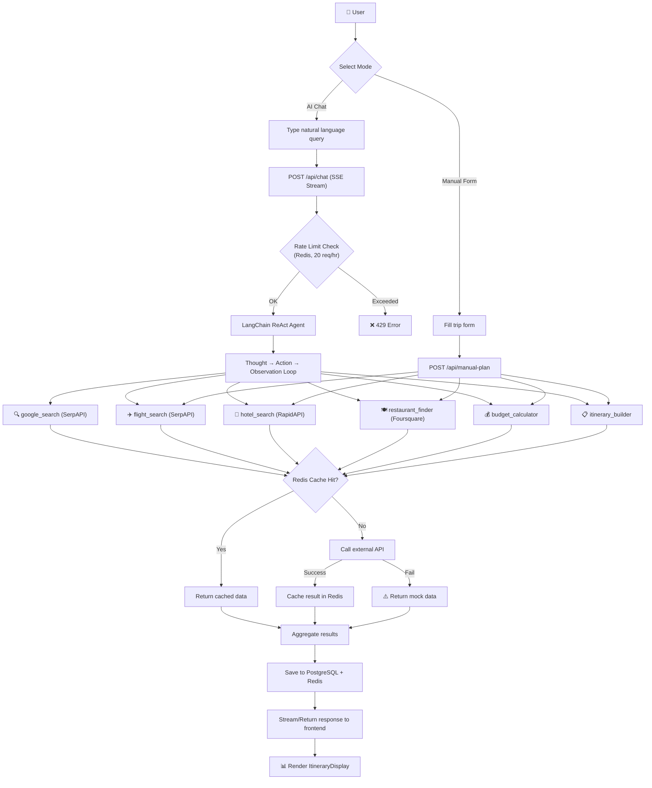
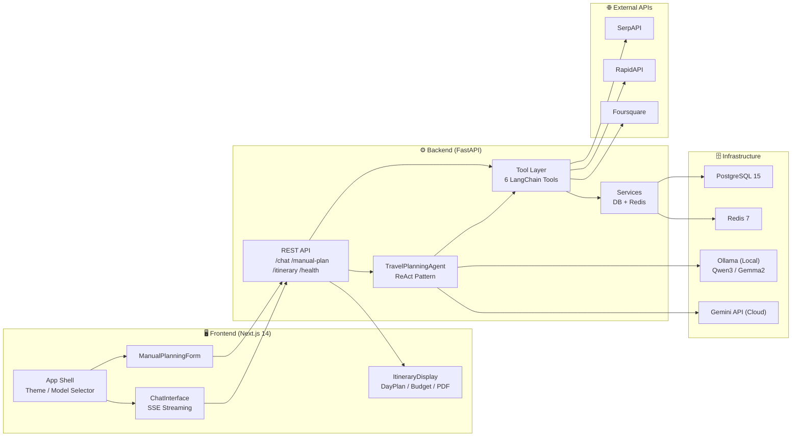
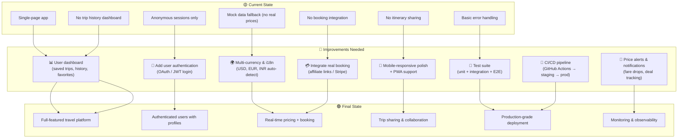
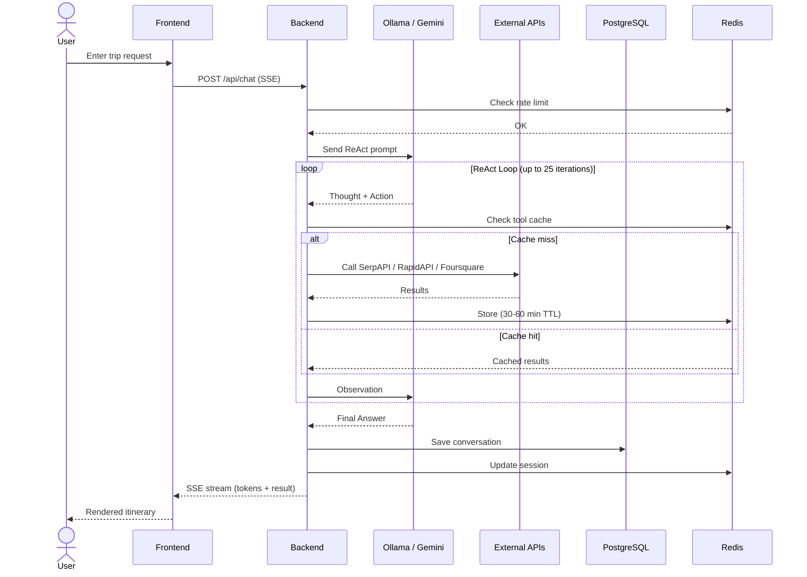

# AI Travel Agent — Workflow Diagrams

---

## 1. Current State

---

## 2. Suggested Solution Architecture

---

## 3. Improvements to Reach Final State

---

## 4. Request-Response Lifecycle (Concise)

